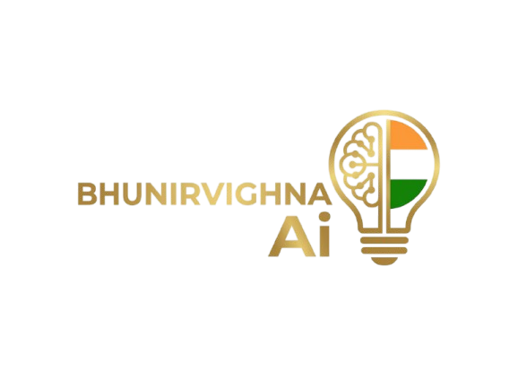
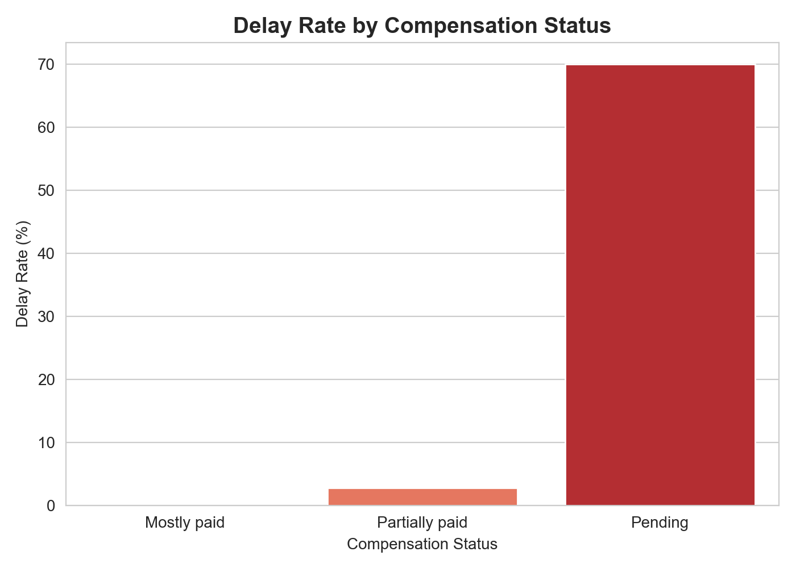
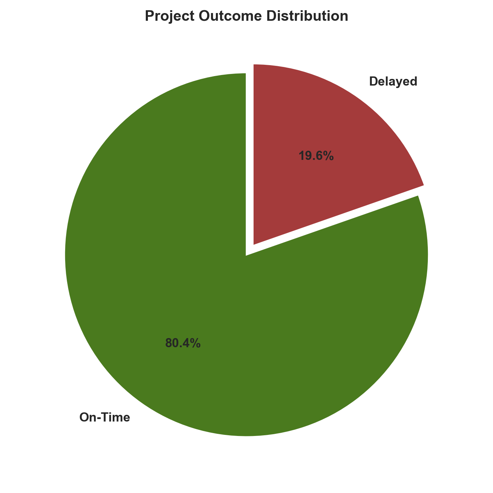

<div align="center">



# BhuNirvighna-Ai

**Predictive Analytics for Early Detection of Land Acquisition Delays**


[](LICENSE)

</div>

---

## 🌍 Overview

Every road, railway line, and irrigation canal built in this country starts the same way: with land that has to be bought from the people who own it. On paper, it's a straightforward legal process. In practice, it's one of the most quietly destructive bottlenecks in infrastructure development - projects that should take two years stretch into six, not because of one dramatic failure, but because of a hundred small, unwatched delays: a compensation cheque stuck in approval, a legal dispute nobody escalated, a resettlement package that stalled at 40% completion and was never followed up on.

**The problem isn't that these delays are unpredictable. It's that nobody is watching for them until it's already too late.**

**BhuNirvighna-Ai** - from the Sanskrit *Nirvighna* (निर्विघ्न), meaning *"free from obstacles"* - is an AI-powered early-warning system built to change that. Instead of waiting for a project to visibly stall and then explaining what went wrong in a post-mortem report, it continuously watches the same signals an experienced administrator would notice - compensation status, legal disputes, possession progress, rehabilitation completion - and flags high-risk projects **months before the delay actually happens.**

This isn't a black box that just says "this project is risky." It explains *why*, in plain language, and recommends what to actually do about it - turning land acquisition monitoring from reactive paperwork into proactive, data-driven governance.

## ⚙️ How It Works

The system is built around four connected capabilities:

1. **Risk Prediction** - A trained ensemble machine learning model (XGBoost) analyzes each project's compensation status, legal disputes, land acquisition progress, and rehabilitation indicators to compute a delay-risk score from 0–100%.

2. **Explainable AI** - Every prediction comes with a SHAP-powered breakdown of *exactly* which factors are driving that project's risk - not a vague label, but a transparent, auditable explanation.

3. **Cost Estimation** - A separate regression model estimates likely compensation cost based on land area, affected families, and project type, giving planners an early financial signal before compensation is even finalized.

4. **Recommendation Engine** - The top risk drivers for each project are automatically translated into plain-language, actionable recommendations - e.g., *"expedite compensation disbursement"* or *"fast-track pending legal disputes."*

All of this is wrapped in an interactive dashboard featuring a live risk gauge, a GIS-based state-wise heatmap, filterable project rankings, and a "predict a new project" tool where planners can test hypothetical scenarios before committing resources.

## 📊 The Dataset

At the heart of this project is a carefully constructed dataset of **2,000 land acquisition projects** spanning **16 states**, **44+ districts**, and **6 major infrastructure categories** - from national highways and railway lines to renewable energy corridors and urban development schemes.

Each project record captures the full lifecycle of a real acquisition case: land area required versus acquired, the number of families affected and displaced, compensation and rehabilitation amounts and progress, legal dispute counts, and the complete notification-to-possession timeline (Sanction → 3A → 3D → Award → Payment → Possession).

Because no ready-made, structured public dataset exists for this specific problem, this dataset was built as a synthetic prototype - its statistical patterns and feature relationships modeled on publicly documented behavior of real Indian land acquisition systems, not fabricated arbitrarily. Every relationship in the data was validated to reflect genuine, defensible patterns: for instance, projects with pending compensation show a dramatically higher delay rate than those mostly paid - a real-world pattern the model learns and explains, rather than a coincidence baked in by chance.

This transparency matters. The dataset is explicitly labeled as a synthetic prototype at the data level, and the modeling pipeline was rigorously checked for data leakage - including catching and correcting two subtle leakage issues during development - so that every reported model metric reflects genuine predictive signal, not an artifact of poorly separated data.

## 🧠 Tech Stack

| Layer | Technology |
|---|---|
| Frontend / Dashboard | Streamlit, Plotly |
| Backend | Python, FastAPI |
| Machine Learning | scikit-learn, XGBoost |
| Explainability | SHAP |
| Database | MySQL (with Spatial Extensions) |
| GIS / Mapping | Folium, GeoJSON |
| Deployment | Streamlit Community Cloud |

## 🚀 Running Locally

```bash
git clone https://github.com/YOUR_USERNAME/BhuNirvighna-Ai.git
cd BhuNirvighna-Ai
pip install -r requirements.txt
streamlit run app.py
```

## 📁 Project Structure

```
BhuNirvighna-Ai/
├── data/
│   ├── raw/
│   └── cleaned/
├── models/
├── notebooks/
├── assets/
│   └── BhNv-logo.png
├── app.py
├── requirements.txt
└── README.md
```

## [Visuals](visuals)

All the Graph Based On Datasets with different perspective




## [Working](workflow.md)

```mermaid
graph LR
    Step1["Step 1: Data Acquisition & Preparation"] --> Step2["Step 2: Exploratory Data Analysis (EDA)"]
    Step2 --> Step3["Step 3: Model Training"]
    Step3 --> Step4["Step 4: Explainability Integration"]
    Step4 --> Step5["Step 5: Dashboard Development"]
    Step5 --> Step6["Step 6: Alerting & Recommendation Logic"]
    Step6 --> Step7["Step 7: Testing & Validation"]
    Step7 --> Step8["Step 8: Packaging for Demonstration"]
```



## 🎯 Vision

Land acquisition delays are ultimately a data visibility problem hiding inside a governance problem. BhuNirvighna-Ai is a step toward closing that gap - not by replacing the judgment of administrators, but by giving them the same kind of early, explainable warning system that other high-stakes domains have long relied on, applied for the first time to one of infrastructure development's oldest and most persistent bottlenecks.

---

<div align="center">

*Built to make delays visible before they become permanent.*

</div>